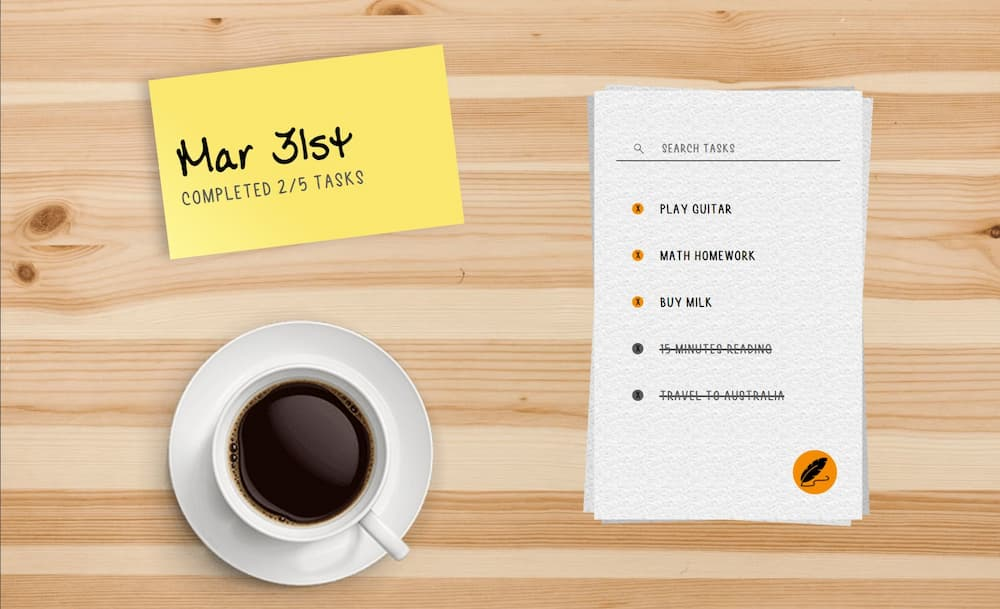
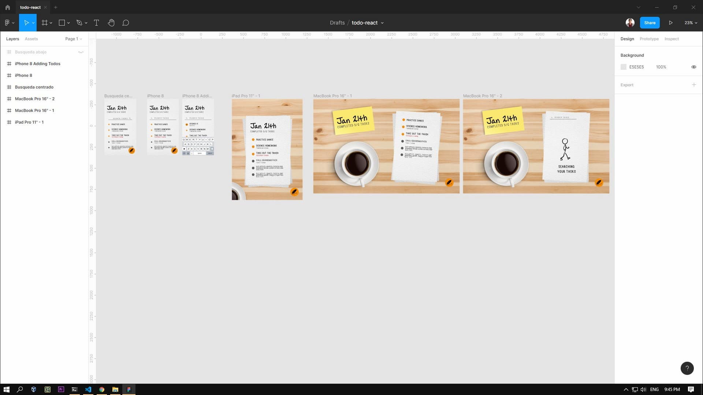
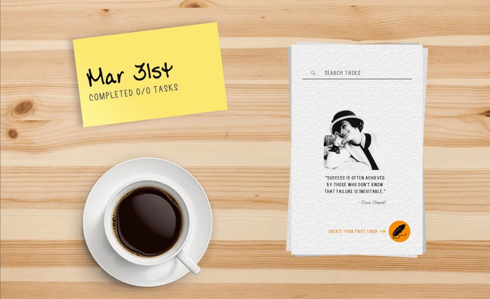
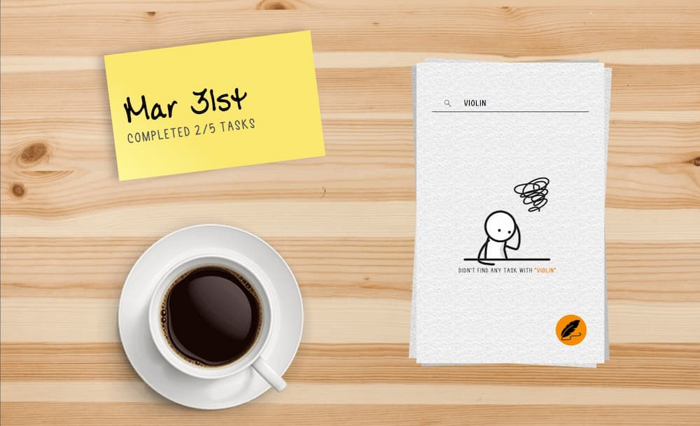

# Todo React

Github Pages Deploy: [https://santigo171.github.io/todo-react/][https://santigo171.github.io/todo-react/]

Github Repo: [https://github.com/santigo171/todo-react][https://github.com/santigo171/todo-react]

> The most efficient app to administrate your tasks and your time.
> \- Elon Musk

Just kidding, this is an app coded with Javascript and React by [David Hurtado][david hurtado] (santigo171) made for the [Curso de Introducción a React.js][curso de introducción a react.js] course in Platzi.

This is my first project in React, almost 40 hours were necessary to end with this result that I really love ♥.

## The process

The process went from the design, taking the course and coding at the same time, implementing features that I wanted and fixing bugs.

### Designing

After feeling with strong bases in Html, Css and Javascript, I started designing my first React project. I used Figma to achieve this.

### Learning & Coding

At the same time I was taking the course, I started coding my first lines of React. [Juan David Castro][juan david castro] is one of the best online courses teachers that you will find, it wasn't hard to learn with his clear and step-by-step explanations.
I was following the teacher but making my own project (I think that that's the idea of taking an online course)

### Implementing features I wanted

After feeling confident with React and finishing all course lessons, I started implementing my own desired features. Like:

- Create first todo with a quote
  
- No match screen
  
- Animations
- Responsive design
- Don't allow repeated todos
- Completely different way of creating new todo
- Sass
- Much more

### Fixing bugs

As you already know, before this app I had no experience with React, bugs appeared and i didn't know why. But after this project I learnt a lot of things, for example, `"npm run eject"` is a headache.

---

## What's next?

I want to update this app and add other features like date support or convert into an Android/Ios app (Don't even know if its possible), but at the moment I will focus on other projects.

[david hurtado]: http://santigo171.github.io "David Hurtado"
[curso de introducción a react.js]: https://platzi.com/cursos/react/ "Curso de Introducción a React.js"
[github pages deploy]: https://santigo171.github.io/todo-react/ "Github Pages Deploy"
[https://santigo171.github.io/todo-react/]: https://santigo171.github.io/todo-react/ "https://santigo171.github.io/todo-react/"
[https://github.com/santigo171/todo-react]: https://github.com/santigo171/todo-react "https://github.com/santigo171/todo-react"
[juan david castro]: https://twitter.com/fjuandc "Juan David Castro"
